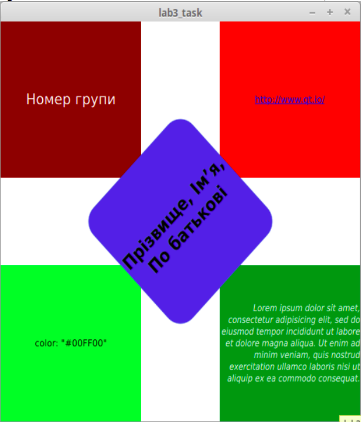

# Лабораторная №8

На базі програмного кода, розробленого у лабораторній роботі №7([https://github.com/xokcton/qt/tree/master/lab7]), додати до інтерфейсу користувача текстові елементи за схемою, наведеною нижче:

